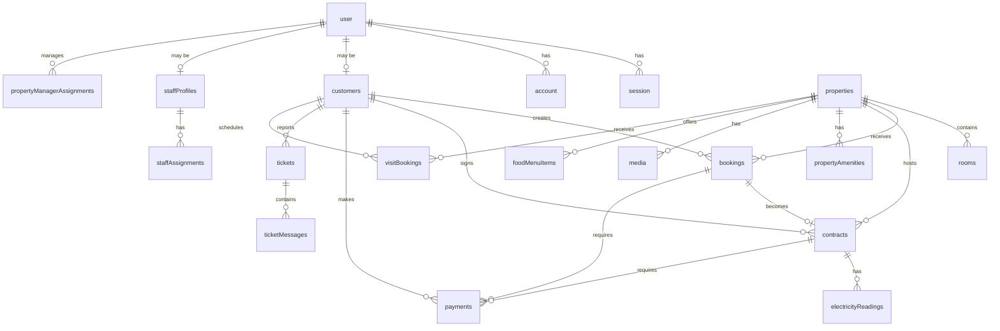

# Database Schema Documentation

This document provides a comprehensive overview of the database schema for the Property Management System.

## Schema Definition

- **Location**: [src/lib/server/db/schema.ts](file:///c:/dev/FLY-pg-v2/src/lib/server/db/schema.ts)
- **Database**: SQLite with Drizzle ORM
- **Type Safety**: Full TypeScript type inference

## Table Categories

The database is organized into two main categories:

### Authentication Tables

Tables managed by **[Better-Auth](https://www.better-auth.com/docs/introduction)** for user authentication and session management.

### Business Domain Tables

Tables specific to the property management system functionality.

---

## Authentication Tables

### `user`

Core user authentication and profile information.

| Column          | Type           | Description                                                            |
| --------------- | -------------- | ---------------------------------------------------------------------- |
| `id`            | `text`         | Primary key (UUID)                                                     |
| `name`          | `text`         | User's full name                                                       |
| `email`         | `text`         | Unique email address                                                   |
| `emailVerified` | `boolean`      | Email verification status                                              |
| `image`         | `text`         | Profile image URL (optional)                                           |
| `role`          | `enum`         | User role: `admin`, `manager`, `property_manager`, `staff`, `customer` |
| `banned`        | `boolean`      | User ban status                                                        |
| `banReason`     | `text`         | Reason for ban (optional)                                              |
| `banExpires`    | `timestamp`    | Ban expiration date (optional)                                         |
| `createdAt`     | `timestamp_ms` | Account creation timestamp                                             |
| `updatedAt`     | `timestamp_ms` | Last update timestamp                                                  |
| `deletedAt`     | `timestamp`    | Soft delete timestamp (optional)                                       |
| `deletedBy`     | `text`         | User ID who deleted (optional)                                         |

### `session`

Active user sessions for authentication.

| Column           | Type           | Description                             |
| ---------------- | -------------- | --------------------------------------- |
| `id`             | `text`         | Primary key                             |
| `expiresAt`      | `timestamp_ms` | Session expiration                      |
| `token`          | `text`         | Unique session token                    |
| `ipAddress`      | `text`         | Client IP address (optional)            |
| `userAgent`      | `text`         | Client user agent (optional)            |
| `userId`         | `text`         | Foreign key to `user.id`                |
| `impersonatedBy` | `text`         | Admin impersonation tracking (optional) |

**Indexes**: `session_userId_idx` on `userId`

### `account`

OAuth and credential accounts linked to users.

| Column         | Type   | Description                                        |
| -------------- | ------ | -------------------------------------------------- |
| `id`           | `text` | Primary key                                        |
| `accountId`    | `text` | Provider-specific account ID                       |
| `providerId`   | `text` | OAuth provider (e.g., google, github)              |
| `userId`       | `text` | Foreign key to `user.id`                           |
| `accessToken`  | `text` | OAuth access token (optional)                      |
| `refreshToken` | `text` | OAuth refresh token (optional)                     |
| `password`     | `text` | Hashed password for credential accounts (optional) |

**Indexes**: `account_userId_idx` on `userId`

### `verification`

Email and identity verification tokens.

| Column       | Type           | Description              |
| ------------ | -------------- | ------------------------ |
| `id`         | `text`         | Primary key              |
| `identifier` | `text`         | Email or phone to verify |
| `value`      | `text`         | Verification code/token  |
| `expiresAt`  | `timestamp_ms` | Token expiration         |

**Indexes**: `verification_identifier_idx` on `identifier`

---

## Business Domain Tables

### `properties`

Property listings and details.

| Column                   | Type        | Description                            |
| ------------------------ | ----------- | -------------------------------------- |
| `id`                     | `text`      | Primary key (UUID)                     |
| `name`                   | `text`      | Property name                          |
| `description`            | `text`      | Property description (optional)        |
| `address`                | `text`      | Street address                         |
| `sector`                 | `text`      | Sector/area (optional)                 |
| `city`                   | `text`      | City                                   |
| `state`                  | `text`      | State                                  |
| `zip`                    | `text`      | ZIP/postal code                        |
| `lat`                    | `real`      | Latitude for maps (optional)           |
| `lng`                    | `real`      | Longitude for maps (optional)          |
| `nearby`                 | `json`      | Nearby landmarks/facilities            |
| `contactPhone`           | `text`      | Contact phone number (optional)        |
| `isFoodServiceAvailable` | `boolean`   | Food service availability              |
| `foodMenu`               | `text`      | Food menu URL/file path (optional)     |
| `electricityUnitCost`    | `real`      | Cost per electricity unit (default: 0) |
| `bookingCharge`          | `integer`   | One-time booking fee (default: 0)      |
| `status`                 | `enum`      | `draft` or `published`                 |
| `createdAt`              | `timestamp` | Creation timestamp                     |
| `updatedAt`              | `timestamp` | Last update timestamp                  |
| `deletedAt`              | `timestamp` | Soft delete timestamp (optional)       |
| `deletedBy`              | `text`      | User ID who deleted (optional)         |

### `rooms`

Individual rooms within properties.

| Column          | Type        | Description                               |
| --------------- | ----------- | ----------------------------------------- |
| `id`            | `text`      | Primary key (UUID)                        |
| `propertyId`    | `text`      | Foreign key to `properties.id`            |
| `number`        | `text`      | Room number/identifier                    |
| `type`          | `enum`      | `single`, `double`, `triple`, or `dorm`   |
| `capacity`      | `integer`   | Maximum occupancy (optional)              |
| `priceMonthly`  | `integer`   | Monthly rent price                        |
| `depositAmount` | `integer`   | Security deposit (optional)               |
| `features`      | `json`      | Array of room features                    |
| `status`        | `enum`      | `available`, `occupied`, or `maintenance` |
| `createdAt`     | `timestamp` | Creation timestamp                        |
| `updatedAt`     | `timestamp` | Last update timestamp                     |
| `deletedAt`     | `timestamp` | Soft delete timestamp (optional)          |
| `deletedBy`     | `text`      | User ID who deleted (optional)            |

**Cascade Delete**: Deleting a property deletes all its rooms.

### `customers`

Tenant/customer profiles.

| Column                  | Type        | Description                                             |
| ----------------------- | ----------- | ------------------------------------------------------- |
| `id`                    | `text`      | Primary key (UUID)                                      |
| `userId`                | `text`      | Foreign key to `user.id` (optional for guest customers) |
| `name`                  | `text`      | Customer name                                           |
| `email`                 | `text`      | Email address                                           |
| `phone`                 | `text`      | Phone number                                            |
| `addressPermanent`      | `text`      | Permanent address (optional)                            |
| `idProofType`           | `text`      | ID document type (optional)                             |
| `idProofNumber`         | `text`      | ID document number (optional)                           |
| `idProofImage`          | `text`      | Scanned ID image URL (optional)                         |
| `emergencyContactName`  | `text`      | Emergency contact name (optional)                       |
| `emergencyContactPhone` | `text`      | Emergency contact phone (optional)                      |
| `status`                | `enum`      | `active` or `inactive`                                  |
| `createdAt`             | `timestamp` | Creation timestamp                                      |
| `updatedAt`             | `timestamp` | Last update timestamp                                   |
| `deletedAt`             | `timestamp` | Soft delete timestamp (optional)                        |
| `deletedBy`             | `text`      | User ID who deleted (optional)                          |

### `bookings`

Room reservation bookings.

| Column          | Type        | Description                                         |
| --------------- | ----------- | --------------------------------------------------- |
| `id`            | `text`      | Primary key (UUID)                                  |
| `propertyId`    | `text`      | Foreign key to `properties.id`                      |
| `roomId`        | `text`      | Foreign key to `rooms.id`                           |
| `customerId`    | `text`      | Foreign key to `customers.id`                       |
| `status`        | `enum`      | `pending`, `confirmed`, `cancelled`, or `completed` |
| `bookingCharge` | `integer`   | Booking fee for this reservation                    |
| `paymentStatus` | `enum`      | `pending`, `paid`, or `refunded`                    |
| `createdAt`     | `timestamp` | Booking creation timestamp                          |
| `updatedAt`     | `timestamp` | Last update timestamp                               |
| `deletedAt`     | `timestamp` | Soft delete timestamp (optional)                    |
| `deletedBy`     | `text`      | User ID who deleted (optional)                      |

### `contracts`

Rental contracts for active tenancies.

| Column              | Type        | Description                                     |
| ------------------- | ----------- | ----------------------------------------------- |
| `id`                | `text`      | Primary key (UUID)                              |
| `customerId`        | `text`      | Foreign key to `customers.id`                   |
| `propertyId`        | `text`      | Foreign key to `properties.id`                  |
| `roomId`            | `text`      | Foreign key to `rooms.id`                       |
| `bookingId`         | `text`      | Foreign key to `bookings.id` (unique)           |
| `contractType`      | `enum`      | `rent`, `lease`, or `other`                     |
| `startDate`         | `timestamp` | Contract start date                             |
| `endDate`           | `timestamp` | Contract end date (optional for month-to-month) |
| `rentAmount`        | `integer`   | Monthly rent amount                             |
| `securityDeposit`   | `integer`   | Security deposit amount (optional)              |
| `includeFood`       | `boolean`   | Whether food service is included                |
| `status`            | `enum`      | `active`, `expired`, or `terminated`            |
| `terminationDate`   | `timestamp` | Contract termination date (optional)            |
| `terminationReason` | `text`      | Reason for termination (optional)               |
| `notes`             | `text`      | Additional contract notes (optional)            |
| `documentUrl`       | `text`      | Signed contract document URL (optional)         |
| `createdBy`         | `text`      | Foreign key to `user.id` (creator)              |
| `createdAt`         | `timestamp` | Contract creation timestamp                     |
| `updatedAt`         | `timestamp` | Last update timestamp                           |
| `deletedAt`         | `timestamp` | Soft delete timestamp (optional)                |
| `deletedBy`         | `text`      | User ID who deleted (optional)                  |

### `payments`

Payment records for rent, deposits, and other charges.

| Column          | Type        | Description                                                                         |
| --------------- | ----------- | ----------------------------------------------------------------------------------- |
| `id`            | `text`      | Primary key (UUID)                                                                  |
| `bookingId`     | `text`      | Foreign key to `bookings.id` (optional)                                             |
| `customerId`    | `text`      | Foreign key to `customers.id` (optional)                                            |
| `contractId`    | `text`      | Foreign key to `contracts.id` (optional)                                            |
| `amount`        | `integer`   | Payment amount                                                                      |
| `type`          | `enum`      | `rent`, `security_deposit`, `maintenance`, `booking_charge`, `electricity`, `other` |
| `status`        | `enum`      | `pending`, `paid`, `failed`, or `refunded`                                          |
| `mode`          | `enum`      | `cash`, `online`, or `upi`                                                          |
| `transactionId` | `text`      | External transaction ID (optional)                                                  |
| `paymentMethod` | `text`      | Payment method details (optional)                                                   |
| `paymentDate`   | `timestamp` | Date payment was made (optional)                                                    |
| `createdAt`     | `timestamp` | Record creation timestamp                                                           |
| `updatedAt`     | `timestamp` | Last update timestamp                                                               |
| `deletedAt`     | `timestamp` | Soft delete timestamp (optional)                                                    |
| `deletedBy`     | `text`      | User ID who deleted (optional)                                                      |

### `electricityReadings`

Monthly electricity consumption tracking.

| Column          | Type        | Description                             |
| --------------- | ----------- | --------------------------------------- |
| `id`            | `text`      | Primary key (UUID)                      |
| `contractId`    | `text`      | Foreign key to `contracts.id`           |
| `propertyId`    | `text`      | Foreign key to `properties.id`          |
| `roomId`        | `text`      | Foreign key to `rooms.id`               |
| `customerId`    | `text`      | Foreign key to `customers.id`           |
| `readingDate`   | `timestamp` | Date of meter reading                   |
| `month`         | `integer`   | Month (1-12)                            |
| `year`          | `integer`   | Year                                    |
| `unitsConsumed` | `real`      | Electricity units consumed              |
| `unitCost`      | `real`      | Cost per unit                           |
| `totalAmount`   | `real`      | Total electricity charge                |
| `note`          | `text`      | Optional note about the reading         |
| `paymentId`     | `text`      | Foreign key to `payments.id` (optional) |
| `createdBy`     | `text`      | Foreign key to `user.id` (creator)      |
| `createdAt`     | `timestamp` | Record creation timestamp               |
| `updatedAt`     | `timestamp` | Last update timestamp                   |
| `deletedAt`     | `timestamp` | Soft delete timestamp (optional)        |
| `deletedBy`     | `text`      | User ID who deleted (optional)          |

**Indexes**: `electricity_readings_unq` on `(contractId, month, year)` to prevent duplicate readings.

### `tickets`

Maintenance and support tickets.

| Column        | Type        | Description                                             |
| ------------- | ----------- | ------------------------------------------------------- |
| `id`          | `text`      | Primary key (UUID)                                      |
| `customerId`  | `text`      | Foreign key to `customers.id` (optional)                |
| `propertyId`  | `text`      | Foreign key to `properties.id` (optional)               |
| `roomId`      | `text`      | Foreign key to `rooms.id` (optional)                    |
| `subject`     | `text`      | Ticket subject/title                                    |
| `type`        | `enum`      | `electricity`, `plumbing`, `furniture`, `wifi`, `other` |
| `description` | `text`      | Detailed issue description                              |
| `status`      | `enum`      | `open`, `in_progress`, `resolved`, or `closed`          |
| `priority`    | `enum`      | `low`, `medium`, or `high`                              |
| `assignedTo`  | `text`      | Foreign key to `user.id` (assigned staff)               |
| `createdAt`   | `timestamp` | Ticket creation timestamp                               |
| `updatedAt`   | `timestamp` | Last update timestamp                                   |
| `deletedAt`   | `timestamp` | Soft delete timestamp (optional)                        |
| `deletedBy`   | `text`      | User ID who deleted (optional)                          |

### `ticketMessages`

Conversation thread for tickets.

| Column      | Type        | Description                               |
| ----------- | ----------- | ----------------------------------------- |
| `id`        | `text`      | Primary key (UUID)                        |
| `ticketId`  | `text`      | Foreign key to `tickets.id`               |
| `senderId`  | `text`      | Foreign key to `user.id` (message sender) |
| `content`   | `text`      | Message content                           |
| `createdAt` | `timestamp` | Message timestamp                         |

**Cascade Delete**: Deleting a ticket deletes all its messages.

### `notifications`

System notifications for users.

| Column      | Type        | Description                                                             |
| ----------- | ----------- | ----------------------------------------------------------------------- |
| `id`        | `text`      | Primary key (UUID)                                                      |
| `userId`    | `text`      | Foreign key to `user.id` (recipient)                                    |
| `senderId`  | `text`      | Foreign key to `user.id` (sender, optional)                             |
| `title`     | `text`      | Notification title (optional)                                           |
| `message`   | `text`      | Notification message                                                    |
| `type`      | `enum`      | `info`, `warning`, `success`, `error`, `rent`, `electricity`, `general` |
| `isRead`    | `boolean`   | Read status                                                             |
| `createdAt` | `timestamp` | Notification timestamp                                                  |
| `deletedAt` | `timestamp` | Soft delete timestamp (optional)                                        |
| `deletedBy` | `text`      | User ID who deleted (optional)                                          |

### `staffProfiles`

Staff member profiles for different roles.

| Column      | Type        | Description                      |
| ----------- | ----------- | -------------------------------- |
| `id`        | `text`      | Primary key (UUID)               |
| `userId`    | `text`      | Foreign key to `user.id`         |
| `staffType` | `enum`      | `chef`, `janitor`, or `security` |
| `createdAt` | `timestamp` | Profile creation timestamp       |
| `updatedAt` | `timestamp` | Last update timestamp            |
| `deletedAt` | `timestamp` | Soft delete timestamp (optional) |
| `deletedBy` | `text`      | User ID who deleted (optional)   |

### `propertyManagerAssignments`

Property manager to property assignments.

| Column       | Type        | Description                                 |
| ------------ | ----------- | ------------------------------------------- |
| `id`         | `text`      | Primary key (UUID)                          |
| `userId`     | `text`      | Foreign key to `user.id` (property manager) |
| `propertyId` | `text`      | Foreign key to `properties.id`              |
| `assignedAt` | `timestamp` | Assignment timestamp                        |
| `assignedBy` | `text`      | User ID who created assignment (optional)   |

### `staffAssignments`

Staff member to property assignments.

| Column           | Type        | Description                               |
| ---------------- | ----------- | ----------------------------------------- |
| `id`             | `text`      | Primary key (UUID)                        |
| `staffProfileId` | `text`      | Foreign key to `staffProfiles.id`         |
| `propertyId`     | `text`      | Foreign key to `properties.id`            |
| `assignedAt`     | `timestamp` | Assignment timestamp                      |
| `assignedBy`     | `text`      | User ID who created assignment (optional) |

### `visitBookings`

Property visit scheduling for prospective tenants.

| Column         | Type        | Description                           |
| -------------- | ----------- | ------------------------------------- |
| `id`           | `text`      | Primary key (UUID)                    |
| `customerId`   | `text`      | Foreign key to `customers.id`         |
| `propertyId`   | `text`      | Foreign key to `properties.id`        |
| `visitDate`    | `timestamp` | Scheduled visit date                  |
| `visitTime`    | `timestamp` | Scheduled visit time                  |
| `status`       | `enum`      | `pending`, `accepted`, or `cancelled` |
| `cancelReason` | `text`      | Cancellation reason (optional)        |
| `cancelledBy`  | `text`      | User ID who cancelled (optional)      |
| `createdAt`    | `timestamp` | Booking creation timestamp            |
| `updatedAt`    | `timestamp` | Last update timestamp                 |
| `deletedAt`    | `timestamp` | Soft delete timestamp (optional)      |
| `deletedBy`    | `text`      | User ID who deleted (optional)        |

### `amenities`

Property amenities catalog.

| Column        | Type        | Description                    |
| ------------- | ----------- | ------------------------------ |
| `id`          | `text`      | Primary key (UUID)             |
| `name`        | `text`      | Amenity name                   |
| `description` | `text`      | Amenity description (optional) |
| `image`       | `text`      | Amenity image URL (optional)   |
| `icon`        | `text`      | Lucide icon name (optional)    |
| `createdAt`   | `timestamp` | Creation timestamp             |
| `updatedAt`   | `timestamp` | Last update timestamp          |

### `propertyAmenities`

Junction table linking properties to amenities.

| Column       | Type   | Description                    |
| ------------ | ------ | ------------------------------ |
| `propertyId` | `text` | Foreign key to `properties.id` |
| `amenityId`  | `text` | Foreign key to `amenities.id`  |

**Composite Primary Key**: `(propertyId, amenityId)`

### `media`

Media files for properties and rooms.

| Column       | Type        | Description                               |
| ------------ | ----------- | ----------------------------------------- |
| `id`         | `text`      | Primary key (UUID)                        |
| `url`        | `text`      | File URL                                  |
| `type`       | `enum`      | `image`, `document`, `video`, or `other`  |
| `propertyId` | `text`      | Foreign key to `properties.id` (optional) |
| `roomId`     | `text`      | Foreign key to `rooms.id` (optional)      |
| `createdAt`  | `timestamp` | Upload timestamp                          |
| `updatedAt`  | `timestamp` | Last update timestamp                     |

### `foodMenuItems`

Food service menu items per property.

| Column         | Type        | Description                                 |
| -------------- | ----------- | ------------------------------------------- |
| `id`           | `text`      | Primary key (UUID)                          |
| `propertyId`   | `text`      | Foreign key to `properties.id`              |
| `category`     | `enum`      | `breakfast`, `lunch`, `dinner`, or `snacks` |
| `name`         | `text`      | Menu item name                              |
| `description`  | `text`      | Item description (optional)                 |
| `isVegetarian` | `boolean`   | Vegetarian indicator                        |
| `isAvailable`  | `boolean`   | Availability status                         |
| `price`        | `integer`   | Item price (optional if included in rent)   |
| `createdAt`    | `timestamp` | Creation timestamp                          |
| `updatedAt`    | `timestamp` | Last update timestamp                       |
| `deletedAt`    | `timestamp` | Soft delete timestamp (optional)            |
| `deletedBy`    | `text`      | User ID who deleted (optional)              |

### `systemSettings`

Application-wide configuration settings.

| Column         | Type        | Description                         |
| -------------- | ----------- | ----------------------------------- |
| `id`           | `text`      | Primary key (UUID)                  |
| `settingKey`   | `text`      | Unique setting identifier           |
| `settingValue` | `json`      | Setting value (JSON format)         |
| `updatedBy`    | `text`      | User ID who last updated (optional) |
| `updatedAt`    | `timestamp` | Last update timestamp               |

---

## Relationships Overview

